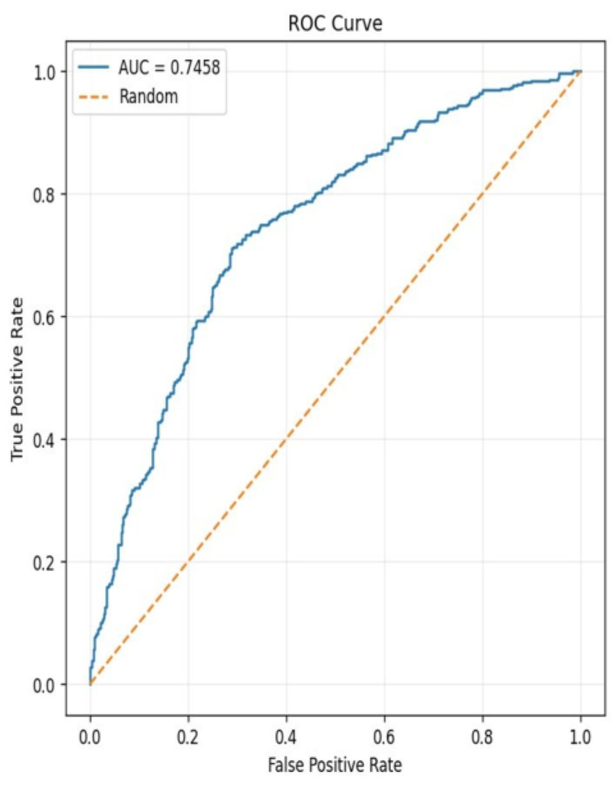
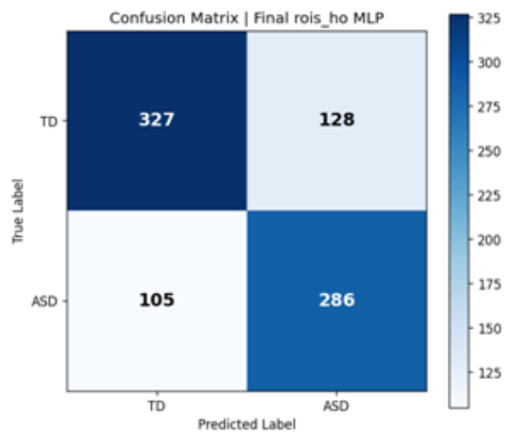
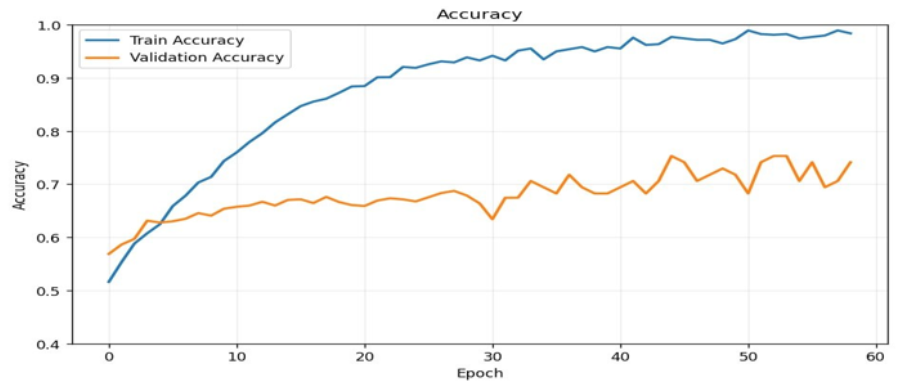
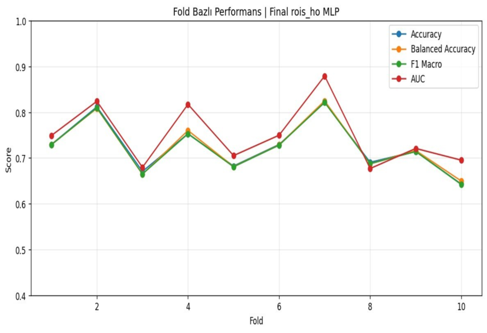
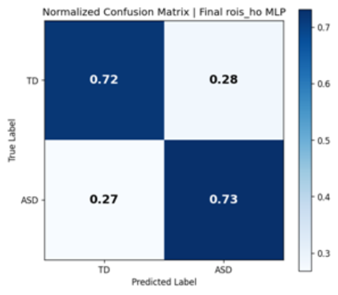
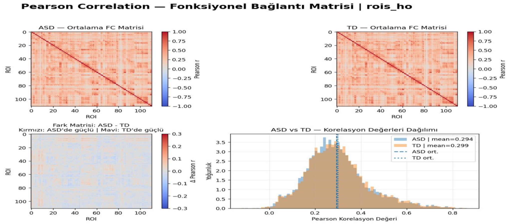

# ABIDE ASD Classification with `rois_ho` Functional Connectivity

This repository contains an ASD-versus-TD classification pipeline based on
resting-state fMRI functional-connectivity features from the ABIDE dataset.
The final experiment uses Pearson connectivity from the Harvard-Oxford
(`rois_ho`) atlas and a class-weighted multilayer perceptron (MLP).

## Dataset acquisition and feature preparation

The ROI time series are obtained from **ABIDE I** through the
[ABIDE Preprocessed Connectomes Project (PCP)](http://preprocessed-connectomes-project.org/abide/)
using Nilearn's
[`fetch_abide_pcp`](https://nilearn.github.io/stable/modules/generated/nilearn.datasets.fetch_abide_pcp.html)
function.

The included `prepare_data.py` script reproduces the project's data-preparation
stage without Google Drive paths. It downloads the following derivatives using
the C-PAC pipeline, 0.01-0.1 Hz band-pass filtering, no global signal regression
and the available quality-control filter:

- `rois_aal`
- `rois_cc200`
- `rois_ho`
- `rois_tt`

After installing the dependencies, run:

```bash
python prepare_data.py \
  --download-dir data/abide_pcp \
  --output-dir data/processed
```

For a small download test, the subject count and atlas list can be limited:

```bash
python prepare_data.py \
  --download-dir data/abide_pcp \
  --output-dir data/processed/test \
  --n-subjects 20 \
  --atlases rois_ho
```

For every subject and atlas, the script:

1. loads the ROI time series in `time points x ROIs` orientation;
2. calculates the ROI-to-ROI Pearson correlation matrix;
3. extracts the upper triangle with `numpy.triu_indices(..., k=1)`;
4. keeps subjects with valid files across every requested atlas;
5. aligns all atlases to the same subject order; and
6. saves compressed NPZ caches containing `X`, `y` and `subjects`.

The full four-atlas run used in this project produced **846 common subjects:
391 ASD and 455 TD**. The ABIDE phenotype field `DX_GROUP` is converted from
the original coding (`1=ASD`, `2=control`) to the model labels used here
(`1=ASD`, `0=TD`). For `rois_ho`, 111 ROIs produce 6,105 unique undirected
edges.

The training file is created at:

```text
data/processed/cpac_rois_ho_FILTERED_corr_features_FIXED.npz
```

Its arrays have the following structure:

- `X`: shape `(846, 6105)`, Pearson-FC upper-triangle vectors
- `y`: shape `(846,)`, where `0=TD` and `1=ASD`
- `subjects`: shape `(846,)`, unique subject identifiers

`feature_summary.csv` and `feature_metadata.json` are also written to the
processed-data directory. Downloaded ABIDE files and generated caches are
excluded from Git and are not distributed in this repository.

## Analysis pipeline

1. Download ABIDE I PCP ROI time series and build aligned Pearson-FC caches.
2. Load the prepared `rois_ho` feature vectors.
3. Apply ANOVA F-score feature selection inside each training fold.
4. Standardize features using statistics learned from the training fold only.
5. Train a class-weighted MLP with Gaussian input noise, label smoothing,
   dropout, AdamW and early stopping.
6. Evaluate with stratified 10-fold cross-validation.
7. Save accuracy, balanced accuracy, macro F1, ROC-AUC, confusion matrix,
   training curves and fold-level results.
8. Reconstruct group-level FC matrices and visualize ASD, TD and ASD-TD
   connectivity patterns.

## Repository structure

```text
abide-fmri-asd-classification/
├── src/
│   ├── __init__.py
│   ├── config.py               # Hyperparameters
│   ├── data.py                 # NPZ loading and FC reconstruction
│   ├── feature_extraction.py   # ROI time series to aligned Pearson features
│   ├── metrics.py              # Evaluation and history utilities
│   ├── models.py               # PyTorch MLP
│   ├── plots.py                # Training plots and Pearson FC maps
│   └── training.py             # One-fold training and inference
├── results/
│   ├── accuracy_curve.png
│   ├── conf_matrix.png
│   ├── conf_matrix_balanced.png
│   ├── fold_performance.png
│   ├── pearson_fc_overview.png
│   └── roc_curve.png
├── prepare_data.py             # ABIDE download and feature-cache entry point
├── train_model.py              # 10-fold training entry point
├── visualize_fc.py             # Pearson FC map entry point
├── requirements.txt
└── .gitignore
```

## Installation

Python 3.10 or newer is recommended.

```bash
git clone https://github.com/ecetulumen/abide-fmri-asd-classification.git
cd abide-fmri-asd-classification

python -m venv .venv
source .venv/bin/activate
pip install -r requirements.txt
```

On Windows, activate the environment with:

```powershell
.venv\Scripts\activate
```

## Model training

After running `prepare_data.py`, start the final experiment with:

```bash
python train_model.py \
  --data-path data/processed/cpac_rois_ho_FILTERED_corr_features_FIXED.npz \
  --output-dir outputs/training \
  --device auto
```

Use `--device cuda` to require a CUDA GPU, `--device cpu` for CPU, or leave
the default `--device auto`.

## Pearson FC map visualization

The map-generation code is divided into three parts:

- `visualize_fc.py` loads the NPZ file and starts the workflow.
- `src/plots.py` creates the ASD mean, TD mean, ASD-TD difference and
  edge-distribution plots.
- `src/data.py` reconstructs each symmetric 111 x 111 FC matrix from its
  6,105 upper-triangle features.

Run it with:

```bash
python visualize_fc.py \
  --data-path data/processed/cpac_rois_ho_FILTERED_corr_features_FIXED.npz \
  --output-dir outputs/pearson_maps
```

The script saves a four-panel overview, separate ASD, TD and ASD-TD matrix
figures, and a JSON file containing group-level summary values.

## Results

Selected outputs from the final experiment are stored in the `results/`
directory and displayed below.

| ROC curve | Confusion matrix |
| --- | --- |
|  |  |

| Training accuracy | Fold-level performance |
| --- | --- |
|  |  |

### Normalized confusion matrix



### Pearson functional-connectivity maps



The group-mean edge distributions largely overlap (ASD mean Pearson
`r=0.294`; TD mean Pearson `r=0.299`). The ASD-TD matrix is presented as a
descriptive group comparison rather than a statistical significance map.

## Evaluation note

The primary summary uses out-of-fold probabilities with the fixed threshold
`0.50`. The code retains the original fold-wise threshold search as an
explicitly exploratory result because each threshold is selected and scored on
the same validation fold. A publication-level estimate based on an optimized
threshold should use nested cross-validation and keep the outer test fold
untouched.

Feature selection and standardization are fitted only on the training portion
of each fold. Duplicate subject identifiers cause an error to reduce the risk
of subject-level leakage.
